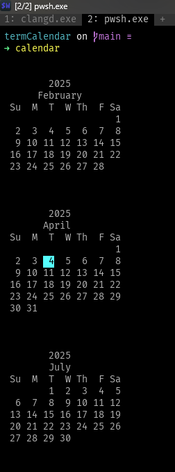

# Terminal Calendar

A simple terminal calendar application written in C.

I created this as just a quick project to display the current month's calendar in the terminal... I also was not aware of the `cal` or `PSCalendar` command, so there's that. 

--Update for 03/04/2025:
Switched from Zeller's Algorithm for determining the day to using built in time.h structures. **The More You Know**

I added it to my powershell profile to overwrite the default commands out of pure hubris.

Please steal the code, improve it, ridicule it, etc- I'm sure there are thousands of these already in existance.

## Enjoy

Example output:

